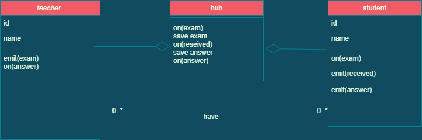

# Quize Project

* *It's a real time communication between Teacher and Students and students share thire camera , so the teacher can send questions that all the students can rescive the question and the students can send the answers to the teacher and the other students can see the answers*

## Authors:

* alaa smadi
* Mahmoud Khader
* eman mkhareez
* Tariq Abu-Laban

## Links and Resources:

### Heroku:

**For the Teacher Join :**

https://our-quiz-app.herokuapp.com/

**For the Student Join :**

https://our-quiz-app.herokuapp.com/student

* ### github :

https://github.com/AlaaN-Smadi/Quiz_Project

## Setup 
### .env requirements :
* ### PORT=3000

## Dependencies needs to install
* ### npm init -y
* ### npm i dotenv express
* ### npm i ejs
* ### npm i http
* ### npm i socket.io
* ### npm i uuid

## To Run the Application
* ### clone the repository
* ### run the command (nodemon)

* UML

Class Digram

Sequence Digram

